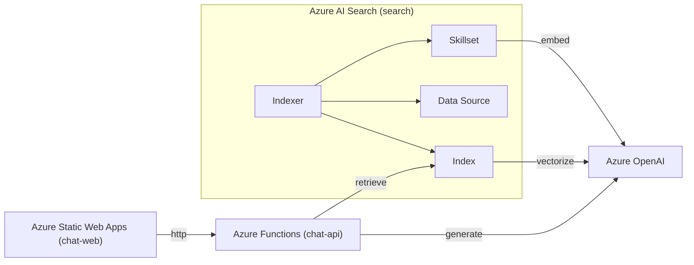

# rag-chatbot

Azure Static Web Apps + Azure Functions + Azure OpenAI + Azure AI Search で構築された RAG チャットボットです。

Azure Bicep による IaC 及び GitHub Actions による CI/CD が含まれています。


## システム構成



## ディレクトリ構成

```
.
├── .github
│   └── workflows/               # GitHub Actions ワークフロー
│       ├── ci.yml               # CI（リント・フォーマット）
│       └── cd-dev.yml           # CD（dev 環境へのデプロイ）
│
├── apps/                        # 各サービスのアプリケーションコード
│   ├── chat-api/                # chat-api （Azure Functions による API）
│   │
│   ├── chat-web/                # chat-web （Azure Static Web Apps による FE）
│   │
│   └── search/                  # search （Azure AI Search）
│
└── infra/                       # 各サービスの IaC
    ├── main.bicep               # Azure リソースの定義
    └── params/                  # 環境別パラメータ
```
各サービス・インフラの詳細は `apps/`、`infra/` 以下の README.md を参照してください。

## CI/CD

- CI: `main` ブランチへのPR作成時にリント・フォーマットのチェックが実行されます。
- CD: `main` ブランチへのマージ時に `dev` 環境へのデプロイされます。

## セットアップ

### CDのセットアップ

#### Azure側

1. Azure CLI にログイン
    - 認証済みでない場合は Azure CLI にログインする。
    
    ```bash
    az login
    ```
    
1. 必要情報の取得
    - アカウント情報を取得
    - 出力から `tenantId` と `subscriptionId` をメモする。
    
    ```bash
    az account show --query "{tenantId:tenantId, subscriptionId:id}"
    ```
    
1. リソースグループの作成
    - リソースグループを作成
    - 補足：`<resourceGroupName>` は `rg-yosh-rcb-dev-jpe` のように命名する。
    - `resourceGroupName` をメモする。
    
    ```bash
    az group create --name <resourceGroupName> --location japaneast
    ```
    
1. アプリの作成
    - アプリを作成
    - 補足：`<displayName>` は `gh-actions-yosh-rcb-dev-jpe` のように命名する。
    - 出力から `appId` をメモする。
    
    ```bash
    az ad app create --display-name "<displayName>"
    ```
    
1. サービスプリンシパルを作成
    
    ```bash
    az ad sp create --id <appId>
    ```
    
1. ロールの割り当て
    
    ```bash
    az role assignment create \
      --assignee <appId> \
      --role contributor \
      --scope /subscriptions/<subscriptionId>/resourceGroups/<resourceGroupName>
    ```
    
1. OIDCの設定
    - `repo:<GitHubUser>/<RepoName>:environment:dev` はデプロイを行う GitHub リポジトリの Environments を指定する。
    
    ```bash
    az ad app federated-credential create --id <appId> --parameters '{
      "name": "gh-actions-dev",
      "issuer": "https://token.actions.githubusercontent.com",
      "subject": "repo:<GitHubUser>/<RepoName>:environment:dev",
      "audiences": ["api://AzureADTokenExchange"]
    }'
    ```
    

#### GitHub側

1.  GitHub リポジトリの Environments に `dev` を追加
1.  `dev` 内で変数を設定
    - secrets
        
        ```bash
        AZURE_CLIENT_ID=<appId>
        AZURE_SUBSCRIPTION_ID=<subscriptionId>
        AZURE_TENANT_ID=<tenantId>
        ```
        
    - variables
        
        ```bash
        RESOURCE_GROUP_NAME=<resourceGroupName>
        ```
        

### ブランチ保護ルールのセットアップ

1. デフォルトブランチを `main` に設定
    - Settings → General → Default branch
2. PRマージ後の自動削除を有効化
    - Settings → General → Pull Requests → Automatically delete head branches
3. ブランチ保護ルールを作成
    - Settings → Code and automation → Rules → Rulesets → New rulessets → New branch ruleset
        - Ruleset Name を `main-protection` に設定
        - Target branches に Include by pattern で `main` を追加
        - Branch rules で以下を有効化
            - Restrict deletions
            - Require a pull request before merge
                - Allowed merge methods で Squash のみを設定
            - Require status checks to pass
                - Add checks で `ci: status check` を追加
                    - 見つからない場合、設定せずに作成し、CIが実行されてから設定し直す。
            - Block force pushed
